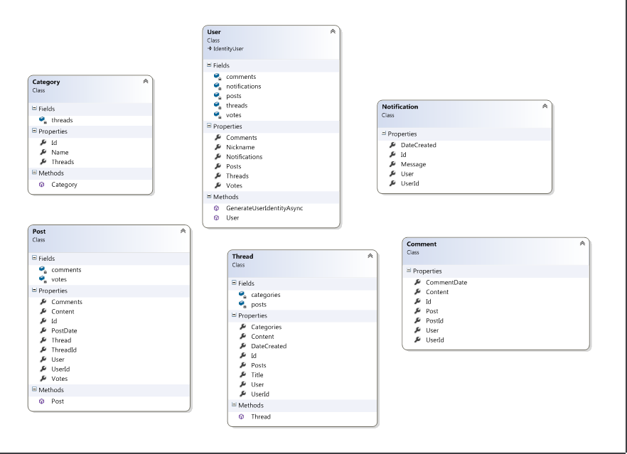

# Team Paulo-Coelho

----------
### Team members:

* **Dimitar Kirov - dimkirov**
* **Todor Dimitrov - TodorDimitrov**
* **Rosen Todorov - RosenTodorov**

### Source control repository URI:

[Forum-Paulo-Coelho](https://github.com/DimitarDKirov/Forum-Paulo-Coelho) 

### Models Class Diagram

### API Controllers:

## ThreadsController

----------
**Methods:**

 * **GetAll()** - GET
 * **GetById(int id)** - GET
 * **Post(ThreadRequestModel requestThread)** - POST [Authorize]
 * **GetByCategory(int categoryId)** - GET

**Endpoints:**

* **api/threads** - GET
* **api/threads/{id}** - GET
* **api/threads?categoryId={id}** - GET
* **api/threads** - POST
 
----------
## PostsController

----------
**Methods:**

 * **Get(int id)** - GET
 * **GetByThread(int threadId)** - GET
 * **Add(int threadId, PostsRequestModel post)** - POST [Authorize]
 * **GetByUser()** - GET
 * **Update(int id, PostsRequestModel post)** - PUT [Authorize]
 
**Endpoints:**

* **api/posts** - GET
* **api/posts/1** - GET
* **api/posts/1 **- PUT
* **api/posts?threadId=1** - GET
* **api/posts?threadId=1** - POST
 
----------
## CommentsController

----------
**Methods:**

 * **Create(int id, CommentDataModel model)** - POST [Authorize]
  
**Endpoints:**

* **api/comments** - POST

----------
## CategoriesController

----------
**Methods:**

 * **Get()** - GET
 * **Add(string name)** - POST [Authorize]
 * **Update(int id, string name)** - PUT [Authorize]
 
**Endpoints:**

* **api/categories** - GET
* **api/categories** - PUT
* **api/categories** - POST

----------

## NotificationsController

----------
**Methods:**

 * **Get()** - GET
 
**Endpoints:**

* **api/notifications** - GET

----------

## Message Queue

* **iron.io**

 Notifications post message functionality is implementet in Post controller and get message functionality in Notifications controller.

### Unit Tests:

* [Api Tests](https://github.com/DimitarDKirov/Forum-Paulo-Coelho/tree/master/Forum-Paulo-Coelho/Tests/ForumSystem.Api.Tests) 

* [Services Tests](https://github.com/DimitarDKirov/Forum-Paulo-Coelho/tree/master/Forum-Paulo-Coelho/Tests/ForumSystem.Services.Test) 

